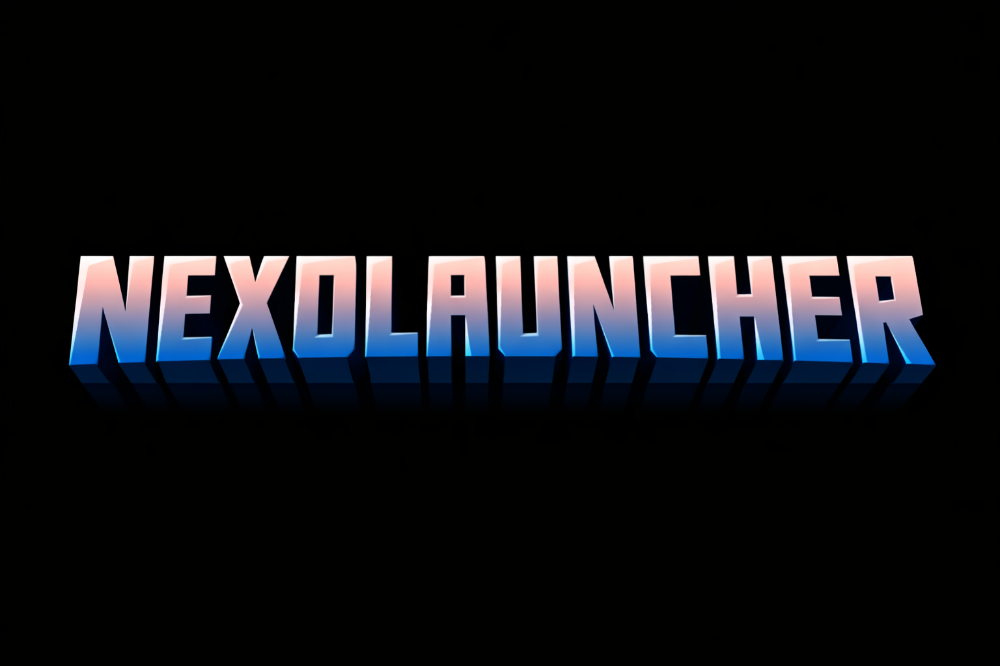

    </img>

<h1 align="center">Nexo Launcher</h1>

    <strong>The Ultimate AI-Powered Minecraft Java Edition Launcher for Android</strong>

---

**Nexo Launcher** is a professional, community-driven Minecraft: Java Edition launcher for Android. Based on the solid foundation of [PojavLauncher](https://github.com/PojavLauncherTeam/PojavLauncher), Nexo Launcher introduces a sleek modern UI and the world's first **AI Smart Assistant** designed to optimize your gaming experience proactively.

## ✨ Why Nexo Launcher?

Nexo Launcher isn't just a tool to open Minecraft; it's a **proactive agent** that manages your game for you.

### 🤖 Proactive AI Smart Assistant
- **Automated Fixes**: Detected a crash? The assistant analyzes logs and applies fixes like adjusting Java versions or graphics renderers automatically.
- **Hardware Optimization**: Automatically tunes RAM allocation and internal resolution based on your device's specs.
- **MobileGlues Integration**: Seamless, automated setup of the high-performance MobileGlues renderer. No manual intervention required.
- **Intelligent Cache Management**: Keeps your storage lean by identifying and cleaning unnecessary temporary files.

### 🎨 Modern & Customizable UI
- **Redesigned Layout**: A sleek, intuitive interface built for modern smartphones.
- **Theming**: Full support for Light and Dark modes with custom background image support.
- **Enhanced File Manager**: Built-in file management to bypass complex Android storage permissions.

### 🛠️ Advanced Game Management
- **Universal JRE Support**: Automated detection and selection of the correct Java version (8, 17, 21) for different Minecraft versions.
- **In-App Downloads**: Download Mods, Modpacks, Resource Packs, and Shaders directly within the launcher.
- **Custom Controls**: Fully editable virtual control layouts with support for joystick deadzones and button snapping.

## 📸 Screenshots

    
    
    

## 🚀 Installation & Building

Nexo Launcher is developed using Android Studio. To build the project:

1. Clone the repository: `git clone https://github.com/Nexolauncher-Team/NexoLauncher.git`
2. Open in **Android Studio**.
3. Sync Gradle and build the APK.

## 🤝 Special Thanks & Credits

Nexo Launcher is built upon the incredible work of the open-source community:

- **[PojavLauncher](https://github.com/PojavLauncherTeam/PojavLauncher)**: The core engine.
- **[ZalithLauncher](https://github.com/ZalithLauncher/ZalithLauncher)**: Initial UI inspiration.
- **[GL4ES](https://github.com/PojavLauncherTeam/gl4es)**: OpenGL translation layer.
- **[OpenJDK](https://github.com/PojavLauncherTeam/openjdk-multiarch-jdk8u)**: Portable Java environment.

---

### ⚖️ License
Nexo Launcher is licensed under the [GNU GPL v3](LICENSE).

    Maintained with 🔥 by <strong>Sameer Yadav</strong>

